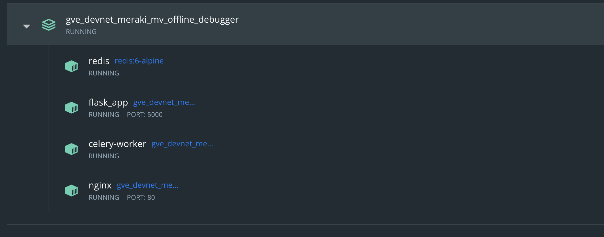
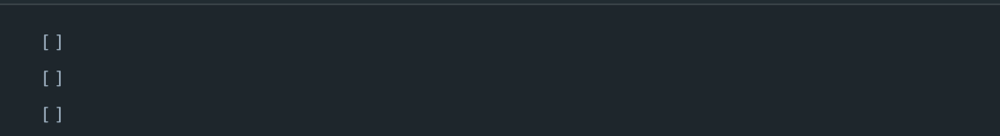
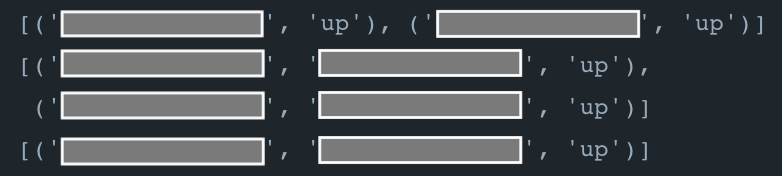
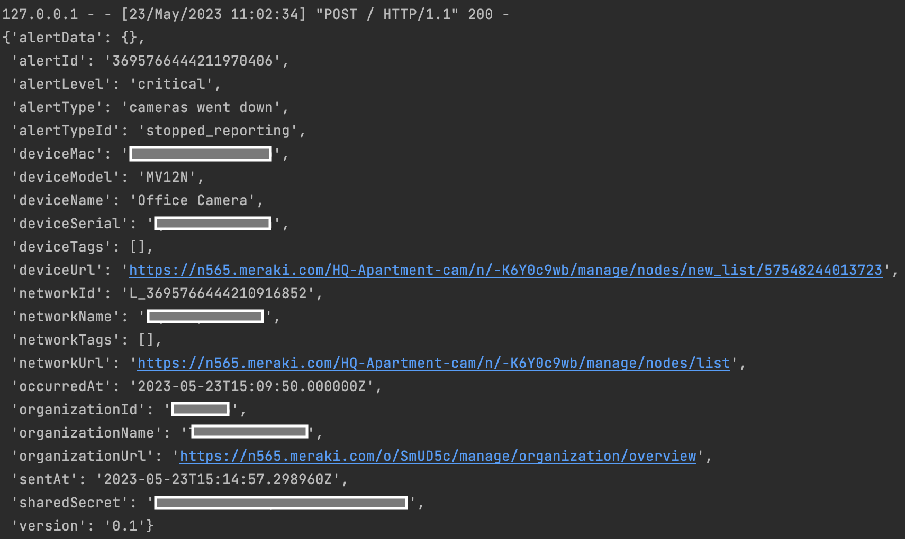
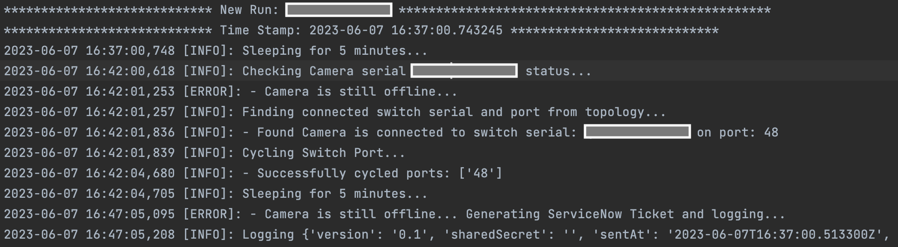
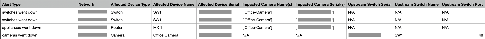

# Meraki MV Offline Troubleshooter

This flask app serves as an automatic troubleshooting and ticketing platform for Meraki MV Cameras **connected to MS Switches**. The app listens for Meraki Webhook Alerts, executes the troubleshooting algorithm, and generates a ServiceNow ticket if the troubleshooting algorithm is unsuccessful in bringing up the MV camera.

The troubleshooting algorithm consists of the steps:
* Receive Camera Down Alert
* `Delay` 5 minutes -> Check Status
* Cycle Connected Switch port
* `Delay` 5 minutes -> Check Status
* Generate Ticket

The `Delay` is configurable and set at 5 minutes by default.

This app also listens for down alerts from Meraki MS and MX devices (if applicable). If an alert is generated for these devices which affects an MV Camera, the app intelligently creates a ticket for the MX or MS with a list of affected cameras. This reduces the number of tickets and introduces network level intelligence.

**Note**:
This code works best with the topology `MX -> MS -> MV`. If the environment doesn't have this topology, there may be issues creating tickets. The intelligent ticket creation depends on the order of alerts and this topology. For ex: an MX alert should come in first before the affected MS and MV devices. The order is usually right, but it can be unpredictable. To guarantee correct behavior, see the `Meraki Alerts` section.

## Contacts
* Trevor Maco

## Solution Components
* Meraki MV
* Meraki Webhooks, APIs
* Docker
* Flask
* SQLite
* Redis
* Celery

## Prerequisites
#### Meraki API Keys
In order to use the Meraki API, you need to enable the API for your organization first. After enabling API access, you can generate an API key. Follow these instructions to enable API access and generate an API key:
1. Login to the Meraki dashboard
2. In the left-hand menu, navigate to `Organization > Settings > Dashboard API access`
3. Click on `Enable access to the Cisco Meraki Dashboard API`
4. Go to `My Profile > API access`
5. Under API access, click on `Generate API key`
6. Save the API key in a safe place. The API key will only be shown once for security purposes, so it is very important to take note of the key then. In case you lose the key, then you have to revoke the key and a generate a new key. Moreover, there is a limit of only two API keys per profile.

> For more information on how to generate an API key, please click [here](https://developer.cisco.com/meraki/api-v1/#!authorization/authorization). 

> Note: You can add your account as Full Organization Admin to your organizations by following the instructions [here](https://documentation.meraki.com/General_Administration/Managing_Dashboard_Access/Managing_Dashboard_Administrators_and_Permissions).

#### ngrok
The webhook receivers for Meraki Alerts require https URLs. Since this code runs on http://localhost:5000, it requires a forwarding address with https in order to receive the webhooks. To emulate this, ngrok is used.
Follow these instructions to set up ngrok:
1. Create a free account or login to [Ngrok](https://ngrok.com/).
2. Retrieve your auth token by navigating to `Getting Started` > `Your Authtoken` on the menu on the left-hand side. Copy the token on this page.
3. Then install the client library depending on your OS [here](https://ngrok.com/download).
4. Once you have ngrok installed, update the ngrok configuration file with your auth token by running the following command on the terminal/command prompt: 
```
ngrok authtoken [yourtoken]
```
replacing [yourtoken] with the authtoken you copied in Step 2.

5. Start the ngrok tunnel for port 5000 with the command:
```
ngrok http 5000
```

#### Meraki Alerts
In order to generate webhooks for the Meraki Alerts this code is written to create tickets for, follow these steps:
1. Login to the Meraki dashboard.
2. In the left-hand menu, navigate to `Network-wide` >  `Configure` > `Alerts`.
3. Here, select the appropriate checkboxes for which events should generate alerts. Under Cameras, select `A camera goes offline for [X] minutes`. Under Security Appliance, select `A security appliance goes offline for [X] minutes`. Under Switch, select `A switch goes offline for [X] minutes`. To guarantee that the alerts are sent in the right order, you can modify the amount of time that should pass before an alert is generated. For instance, keep the security appliance at 5 minutes, but increase the time of the switch to 10 minutes and the camera to 15 minutes. Thus, if a router goes down, then after 5 minutes, a ticket will be created for it once the alert is generated but it will take 5 more minutes before the switch connected to the router will generate an alert.
4. Next, you need to add the webhook receiver to send the alert webhooks to. Under the `Webhooks` section, add an HTTP receiver. Give it a name and copy the https URL for the flask app as the receiver URL. Use `ngrok` webhook receiver if running locally.
5. Then, add the webhook receiver as a default recipient of alerts. Scroll to the top of the page to the `Alerts Settings` section, add the webhook receiver that you just created to the Default recipients list.
6. Scroll to the bottom of the page and click `Save` to save these changes.

> For more information about Meraki Alerts and Notifications, please click [here](https://documentation.meraki.com/General_Administration/Cross-Platform_Content/Alerts_and_Notifications).

#### Docker
To support scalability, this app uses several technologies (Celery, Redis, etc.) that are easily tied together with `Docker`. `Docker` is the recommended deployment method. Install `Docker` [here](https://docs.docker.com/get-docker/).

## Installation/Configuration
1. Clone this repository with `git clone [repository name]`
2. Add Meraki API key, and CSV File Path for Ticket information to environment variables in `flask_app/config.py`. The CSV File is a backup of ticket information for manual ServiceNow ticket creation.
```python
MERAKI_API_KEY = ""
TICKET_CSV_PATH = ""
```
3. Set up a Python virtual environment. Make sure Python 3 is installed in your environment, and if not, you may download Python [here](https://www.python.org/downloads/). Once Python 3 is installed in your environment, you can activate the virtual environment with the instructions found [here](https://docs.python.org/3/tutorial/venv.html).
4. Install the requirements with `pip3 install -r flask_app/requirements.txt`

## Usage
To run the program, use the docker command:
```
$ docker-compose up -d --build
```

This will build the containers in the background and launch them. If you have docker desktop, you should see (assuming no errors):



The docker-compose file runs 3 main python scripts:

1. `db.py`

This script creates the database that will hold the connection and status information of the routers, switches, and cameras in the network (critical for intelligent ticketing).

Once this code completes, it will print out three empty lists representing the items in the routers, switches, and cameras tables. It will also create the database file `sqlite.db`.



2. `populate.py`

The next step is to populate the database with the devices in your Meraki network, which is done with this script.

Once the code completes, it will print out the contents of the routers, switches, and camera tables in the database representing (Source Serial, Connected Device Serial, Source Status)



**Note**: this code is written with the assumption that the switches are connected to routers and the access points are connected to switches. If this is not the case in your environment, it will likely generate an error. To remedy this, add more conditions in the file. For example, there is a condition to check if the device types connected to one another are an 'Camera' and 'switch'. Suppose you have switches connected to switches in your environment, you will need to add a condition to the code that checks if the device types are both 'switch' and then write the code to handle this condition.

3. `app.py` (`flask run`)

The main web app will start and begin listening on default port `5000`. 

Once a webhook is received, the contents will be printed out:



A down camera will trigger the troubleshooting automation. The results of the automation are written to a log file in `flask_app/logs/[alerting serial].log`:



A Ticket is created in ServiceNow if the troubleshooting process is unable to revive the down camera. The ticket content is written to a CSV File specified in `config.py` as well:




### LICENSE

Provided under Cisco Sample Code License, for details see [LICENSE](LICENSE.md)

### CODE_OF_CONDUCT

Our code of conduct is available [here](CODE_OF_CONDUCT.md)

### CONTRIBUTING

See our contributing guidelines [here](CONTRIBUTING.md)

#### DISCLAIMER:
<b>Please note:</b> This script is meant for demo purposes only. All tools/ scripts in this repo are released for use "AS IS" without any warranties of any kind, including, but not limited to their installation, use, or performance. Any use of these scripts and tools is at your own risk. There is no guarantee that they have been through thorough testing in a comparable environment and we are not responsible for any damage or data loss incurred with their use.
You are responsible for reviewing and testing any scripts you run thoroughly before use in any non-testing environment.